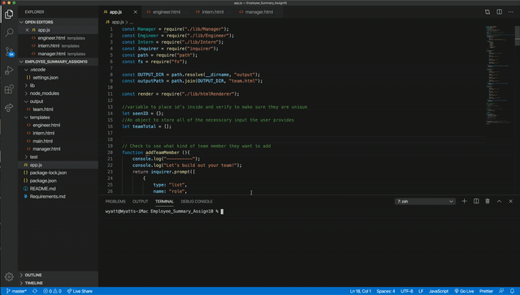
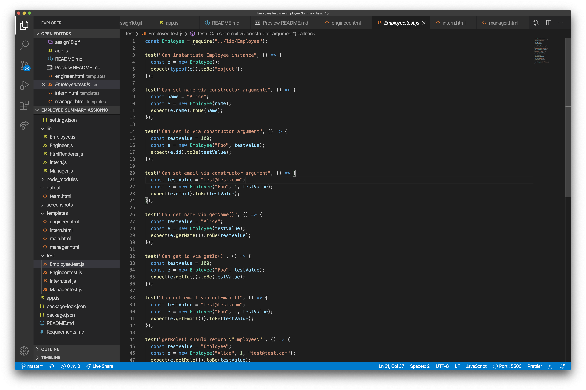
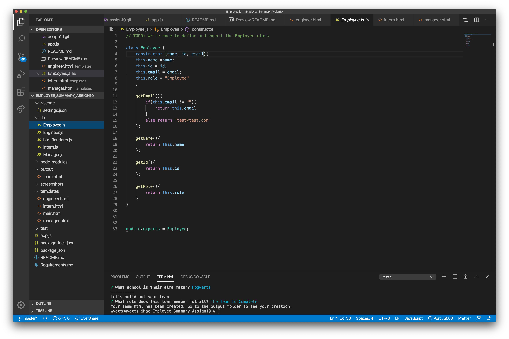
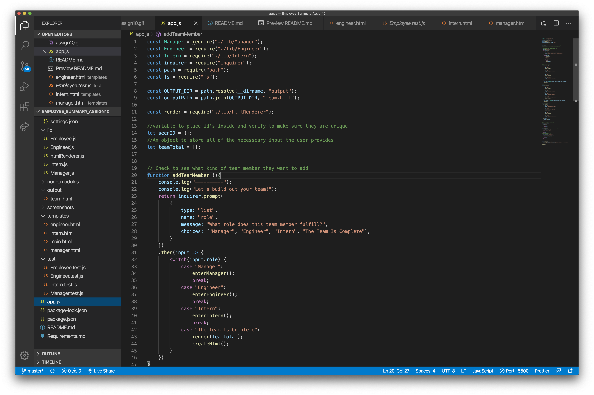
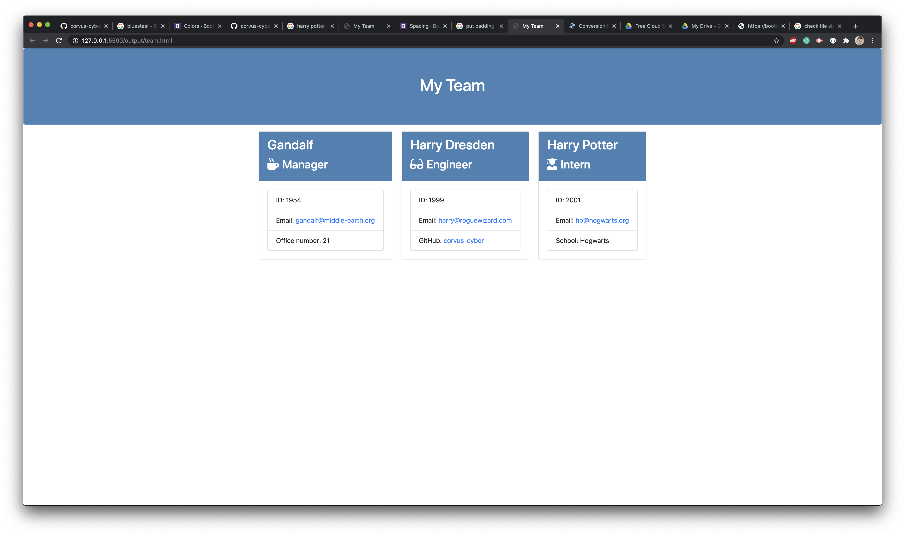

# Employee Team Generator

# Purpose and Usage
This assignment takes node.js, javascript, a variety of npms, and builds a html that acts as a quick reference for the different members of a team. 
The user will first install the package.json via the command line, then enter node app.js to begin the series of questions and prompts, and then they will be presented with a polished html that will contain their enter information inside of the output folder. This html will be titled team.html.
I built this project in order to test my newfound knowledge in node.js,  javascript, the usage of npms, the building of classes and subclasses, and the effective useage of test.js

# Table of Contents
1. [Process](#Process)
2. [Issues](#Issues)
3. [Mastered](#Mastered)
4. [Video](#Video)
5. [Screenshots](#Screenshots)

# Process 
* As it stated at the beginning of the instructions, it was vital that the different js files were qualified by the different test files. I began by writing out the different js files so that their constructors and functions fit the perameters of the pre-designed tests.
* I then built the objects within app.js, using inquirer, so that there would be unique messages for each of the different employee types, so that the different responses needed to build the html would be validated.
* From there I built an object and function that would let the user choose between the different employee types, uses a case and switches. I also included the option that the team had been completed, which would take them to a function for writing the file. 
* I then built the write file function, which used the pre-designed html formats (with some tweaks that I provided, which would alter the coloring and margins) to build a new html document within the output folder
* As a final touch I created a series of validation functions which would make sure that the user was putting in the same id's multiple times, to make sure that the user entered a value, and a function to make sure that the email had valid content (I obtained the code for this at [UVI.dev/validate-email](https://ui.dev/validate-email-address-javascript/)).  

# Issues I Encountered 
* I accidentally kept the characteristics of the "employee" inside of a function for a long time, this meant that I could not build out the necesscary functions that depended on it without having to expand require module. In order to fix this and keep my code dry, I change Employee to a class in which I placed the necesscary functions. 
* When building out the app.js I was trying to begin the prompts by asking what role the user's wanted to input, but it wouldn't follow up on the user's response. In order to fix this I needed to put break at the end of each case so that it would end the case and direct the user to the proper function
* I had difficult conceptually understanding how to check whether the user was entering an already pre-existing id. In order to solve this, I went to an instructional assistant, who said it would be a good idea to build an empty array that would hold ids. From there I built a function that would check this array, and if it already had this id within it it would not allow the user to proceed. Once a non duplicate was entered it would be added to the array for future verification. 
* I had difficulty deploying the user's output, as the content placed within lib folder over-rode the users. In order to fix this, I built an if statement inside of the classes that would let the user's input to replace the default. That way the tests would still be proven true, while not preventing the user from deploying their responses.

# Mastered
* How to effectively run a test 
* How to develop the output for an html file within javascript and node.js
* How to run validation functions to test user's output
* How to use switch and cases in order to bounce between different objects

# Video 

# Screenshots 

